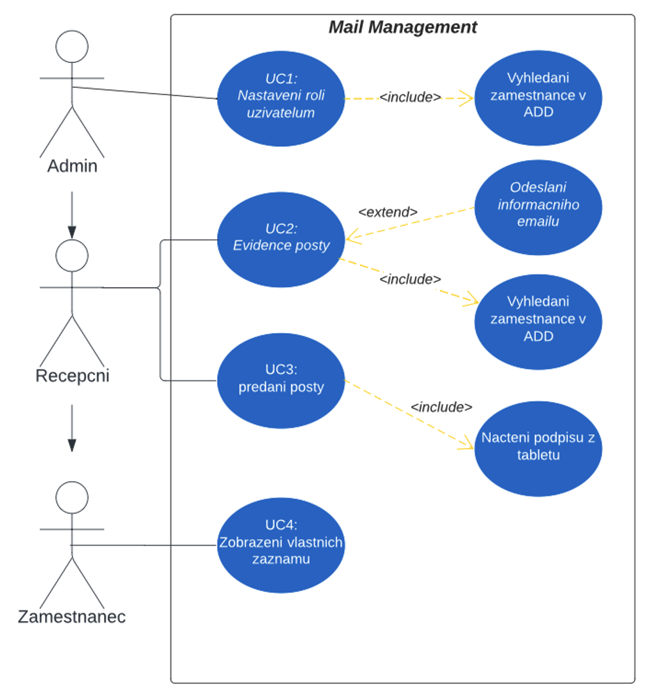
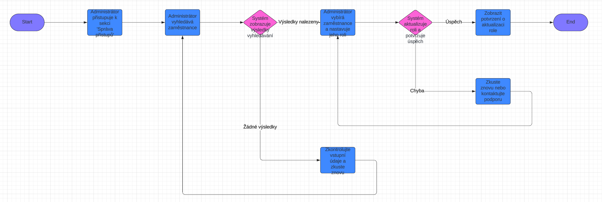
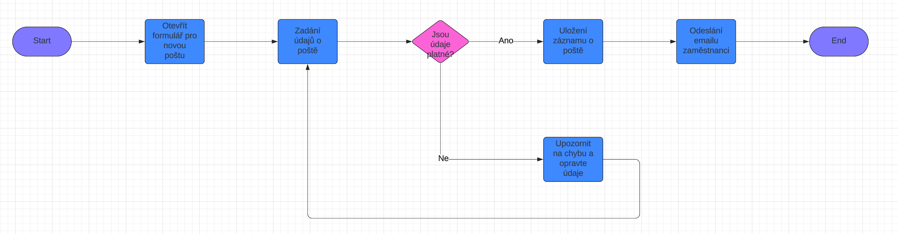
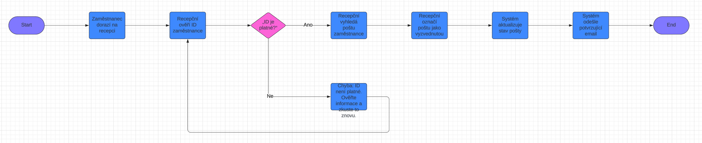

# Funkční Specifikace: Mail Management

## Use Case Model

Níže je uveden Use Case model pro informační systém **Mail Management**. Diagram znázorňuje hlavní aktéry a jejich interakce se systémem.

## Scénáře

### Název: Nastavení role uživatelům

**Aktéři:** Administrátor

**Vstupní podmínky:** Uživatel je přihlášen

**Spouštěč:** Akce administrátora

**Úspěšný scénář:**
1. Administrátor vybere možnost „Správa přístupů“.
2. Otevře se nové okno.
3. Administrátor vyhledá zaměstnance.
4. Administrátor vybere požadovanou roli.
5. Systém aktualizuje roli zaměstnance.

**Alternativní scénář:**
1. Administrátor vyhledává zaměstnance.
2. Systém nenajde zaměstnance.
3. Zobrazí se chybová hláška.

### Název: Evidence pošty

**Aktéři:** Recepční

**Vstupní podmínky:** Recepční je přihlášen

**Spouštěč:** Příchod nové pošty na recepci

**Úspěšný scénář:**
1. Recepční vybere možnost „Nová pošta“.
2. Zobrazí se formulář pro evidenci pošty.
3. Recepční vyplní údaje o poště a přiřadí ji zaměstnanci.
4. Systém uloží záznam o nové poště.
5. Zaměstnanci je o nové poště zaslán informační email.

**Alternativní scénář:**
1. Recepční vyplňuje údaje o poště.
2. Systém zjistí neplatné údaje.
3. Zobrazí se chybová hláška.

### Název: Předání pošty

**Aktéři:** Recepční, Zaměstnanec

**Vstupní podmínky:** Zaměstnanec má přiřazenou poštu

**Spouštěč:** Zaměstnanec přijde pro poštu na recepci

**Úspěšný scénář:**
1. Zaměstnanec dorazí na recepci a předloží ID kartu.
2. Recepční vyhledá nevyzvednutou poštu zaměstnance.
3. Recepční zvolí možnost „Označit jako vyzvednuté“.
4. Systém aktualizuje stav pošty na vyzvednutou.
5. Systém odešle potvrzující email zaměstnanci.

**Alternativní scénář:**
1. Zaměstnanec dorazí na recepci bez platného ID.
2. Recepční zamítne předání pošty.
3. Zobrazí se chybová hláška.

