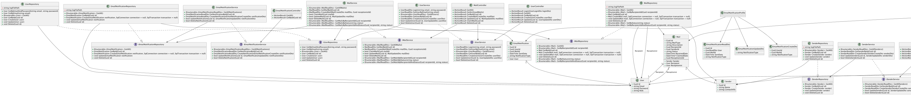
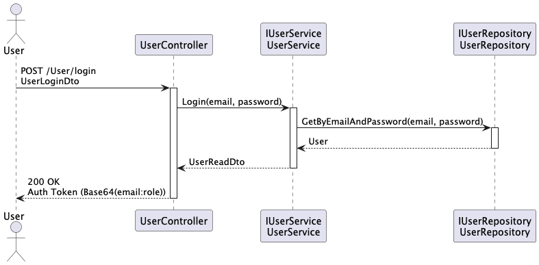
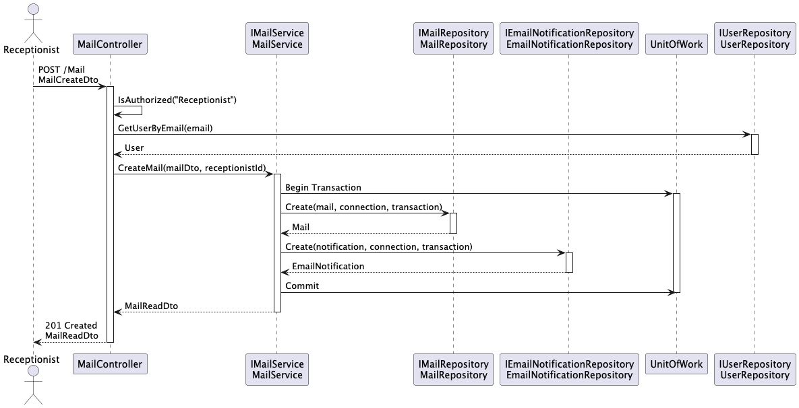
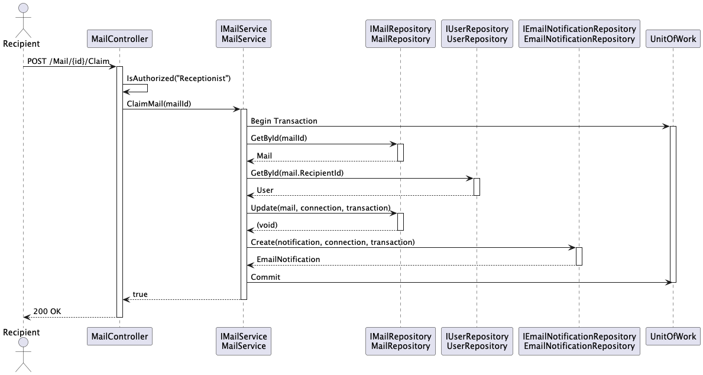

# Specifikace modelu: Mail Management

## Class Diagram aplickae Mail Management

## Sekvenční diagramy pro následující klíčové operace

### Přihlášení Uživatele

### Vytvoření nového záznamu o příchozí poště

### Vyzvednutí pošty zaměstnancem

## Seznam použitých Design Patternů

	-	Repository
	-	Unit of Work
	-	Data Transfer Object (DTO)
	-	Data Mapper
	-	Service Layer
