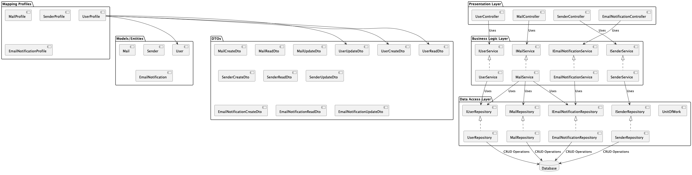

# Architektura: Mail Management

## Přehled Architektury

Architektura systému **Mail Management** je navržena s důrazem na modularitu, škálovatelnost a snadnou údržbu. Systém je rozdělen do logických a fyzických vrstev, které spolu komunikují prostřednictvím definovaných rozhraní.

## Diagram Komponent

Diagram komponent znázorňuje softwarové komponenty použité v systému **Mail Management** a jejich vzájemné interakce. Komponenty zahrnují jak vlastní vývoj, tak i třetí strany.

## Technologické Komponenty a Platformy

### Technologie

- **Backend:**
  - **ASP.NET Core** pro vývoj REST API
- **Frontend:**
  - **Bootstrap** pro responzivní design
  - **JavaScript** pro interaktivitu
- **Databáze:**
  - **Microsoft SQL Server** běžící v **Dockeru**
- **Kontejnerizace:**
  - **Docker** pro izolované prostředí databáze

### Cílové Platformy

- **Webová Aplikace:**
  - Intranetová aplikace dostupná přes moderní webové prohlížeče (Chrome, Firefox, Edge)
- **Mobilní Zařízení:**
  - Responzivní design optimalizovaný pro smartphony a tablety
- **Desktop:**
  - Přístup přes webové prohlížeče na desktopových operačních systémech (Windows, macOS, Linux)